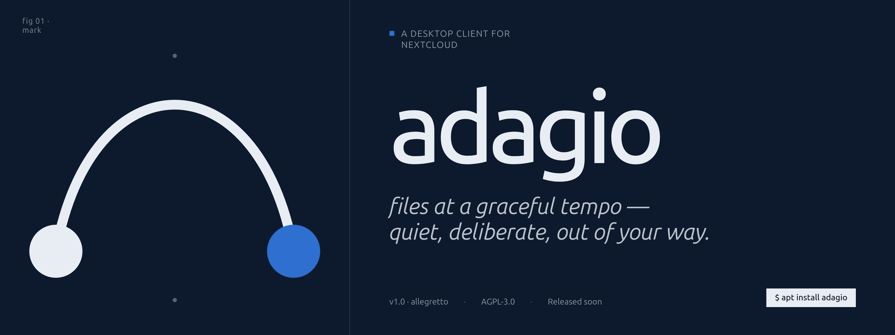

# Adagio

Adagio is a quiet, editorial Nextcloud synchronization client for the desktop. Built with Rust and Tauri, it provides a high-performance, resource-efficient, and reliable way to keep your files in tempo across your devices.




## Core Principles

Adagio is built on five foundational engineering mandates defined in our project Constitution:

1.  **Test-First (NON-NEGOTIABLE)**: Every feature begins with a failing test. We strictly enforce the Red-Green-Refactor cycle to ensure behavioral correctness and prevent regressions.
2.  **Documentation as Code**: Documentation is a first-class deliverable. Architectural decisions are recorded as ADRs, and every feature is defined by a specification in the `specs/` directory.
3.  **Observability**: Runtime state is always inspectable via structured logging and timing metrics. Silent failures are prohibited.
4.  **Extensibility**: The core sync engine is decoupled from specific service implementations and the UI, allowing for future integrations (Notes, Talk, Calendar) without modifying the core infrastructure.
5.  **Performance-Oriented**: Resource efficiency is a primary constraint. Adagio is designed to use less than 100 MB RSS at idle and under 5% CPU during steady-state background sync.

## Key Features

- **Bidirectional Sync**: Real-time change detection for local files and efficient PROPFIND-based polling for remote changes.
- **Deterministic Reconciliation**: A three-way diff (local, remote, journal) ensures every sync cycle produces a clear, safe operation plan.
- **Conflict Management**: Policy-driven resolution with a default "preserve both" approach that ensures no user data is ever silently discarded.
- **Large File Support**: Nextcloud's proprietary chunked upload protocol and range-request resuming for downloads.
- **Selective Sync**: Fine-grained control over which remote directories are materialized locally.
- **Bandwidth Controls**: Configurable upload/download caps and time-window based scheduling.
- **Modern UI**: An editorial design system built with Svelte 5, featuring 8 custom color palettes and a quiet, status-first interface.
- **Secure Authentication**: OAuth2 with PKCE flow; credentials never touch the disk and are stored exclusively in OS-native keychains.

## Architecture

Adagio is organized as a Cargo workspace with three primary crates:

- **`adagio-core`**: The headless sync engine. Contains the orchestrator, reconciler, journal (SQLite), and transfer management logic. No UI or platform-specific dependencies.
- **`adagio-nextcloud`**: Nextcloud protocol extensions, implementing the `RemoteClient` trait for WebDAV, OCS, and proprietary chunked uploads.
- **`adagio-desktop`**: The Tauri 2.x application shell and Svelte 5 frontend. Handles the window lifecycle, system tray integration, and IPC commands.

## Tech Stack

- **Backend**: Rust (stable, edition 2021)
- **Runtime**: Tokio (async)
- **UI Shell**: Tauri 2.x
- **Frontend**: Svelte 5 + TypeScript + Vite
- **Persistence**: SQLite (via `sqlx`) for sync history, JSON for configuration
- **Security**: `keyring` for OS-native credential storage
- **Typography**: Geist (UI/Body), Geist Mono (Metadata), Instrument Serif (Accents)

## Getting Started

### Prerequisites

- Rust (stable, ≥ 1.78)
- Node.js (≥ 20)
- Tauri CLI (`cargo install tauri-cli --version "^2"`)
- SQLite 3 development headers

### Build and Run

1.  **Clone the repository**:
    ```bash
    git clone https://github.com/TheDarkPyotr/adagio.git
    cd adagio
    ```

2.  **Install frontend dependencies**:
    ```bash
    npm install --prefix crates/adagio-desktop/src-ui
    ```

3.  **Run in development mode**:
    ```bash
    cd crates/adagio-desktop
    cargo tauri dev
    ```

For detailed setup instructions, including integration testing against a live Nextcloud instance in Docker, see [specs/001-nextcloud-file-sync/quickstart.md](specs/001-nextcloud-file-sync/quickstart.md).

## Development Workflow

Adagio follows a **Spec-Driven Development (SDD)** workflow:

1.  **Specify**: Define requirements and user scenarios in `specs/###-feature-name/spec.md`.
2.  **Plan**: Draft a technical implementation plan and ADRs in the feature directory.
3.  **Tasks**: Generate a task list in `tasks.md`, ensuring test tasks precede implementation.
4.  **Implement**: Execute tasks following the red-green-refactor cycle.

All active and completed specifications can be found in the [specs/](specs/) directory.

## License

Source code is licensed under **AGPL-3.0**. Design system and brand assets are © .
